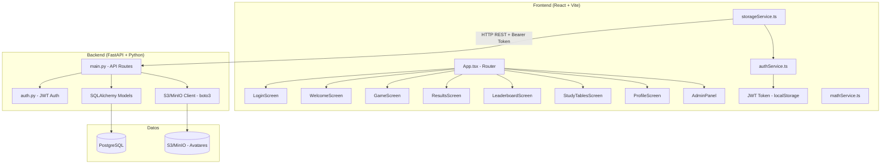
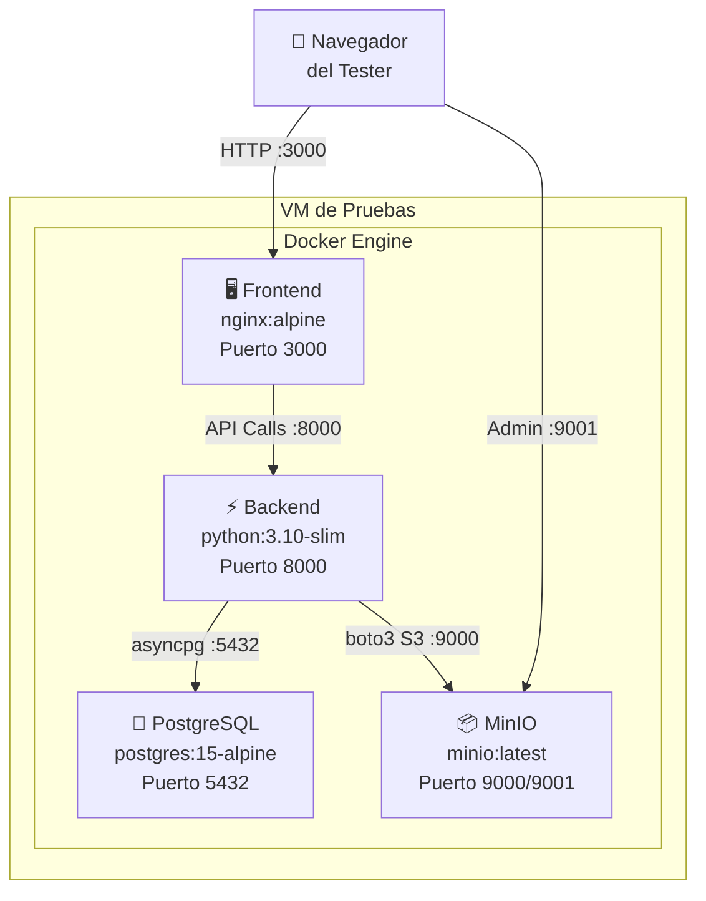

# 📊 Reporte de Análisis Completo — Math-Change

> Análisis exhaustivo de la aplicación **Math-Change**: funcionalidades, arquitectura, infraestructura requerida y guía de despliegue para pruebas.

---

## 1. ¿Qué es Math-Change?

**Math-Change** es una aplicación web educativa de entrenamiento matemático diseñada para niños y estudiantes. Permite practicar operaciones aritméticas (sumas, restas, multiplicaciones, divisiones) a través de un sistema gamificado con niveles progresivos, puntajes y un panel administrativo completo.

---

## 2. Funcionalidades Completas

### 2.1 Sistema de Juego (Core)

| Funcionalidad | Descripción |
|---|---|
| **8 Categorías de juego** | Sumas, Restas, Tablas (×), División (÷), Suma y Resta combinadas, Multiplicación + Operaciones, Experto (todas), y **Desafío Mix** (progresivo automático) |
| **6 Niveles de dificultad** | Easy → Easy-Medium → Medium → Medium-Hard → Hard → Random Tables |
| **50 preguntas por partida** | Cada partida consiste en 50 preguntas con temporizador individual |
| **Temporizador dinámico** | 10-18 segundos por pregunta según dificultad; en modo "Desafío" se adapta automáticamente |
| **Progresión de niveles** | Los niveles se desbloquean al obtener ≥60% de precisión en el nivel actual |
| **Progresión independiente por categoría** | Cada categoría (sumas, restas, etc.) tiene su propio progreso de desbloqueo |
| **Teclado virtual** | Teclado numérico integrado para tablets y dispositivos táctiles (visible en landscape/desktop) |
| **Feedback visual** | Animaciones de correcto/incorrecto con la respuesta correcta mostrada en errores |
| **Modo Desafío** | Dificultad progresiva automática en bloques de 10 preguntas (Q1-10: Easy, Q11-20: EasyMedium, etc.) |

### 2.2 Sistema de Autenticación y Usuarios

| Funcionalidad | Descripción |
|---|---|
| **Registro** | Crear cuenta con usuario, email y contraseña |
| **Login JWT** | Autenticación con tokens JWT (HS256) almacenados en localStorage |
| **Modo Invitado** | Jugar sin registrarse (sin persistencia de progreso) |
| **Sesión persistente** | Auto-restauración de sesión al recargar la página |
| **Roles** | `USER` (jugador normal) y `ADMIN` (acceso al panel administrativo) |
| **Estados** | `ACTIVE` y `BANNED` (bloqueo de acceso) |
| **Perfil de usuario** | Pantalla de perfil con edición de datos y avatar |
| **Avatar personalizado** | Subida de imágenes de perfil, procesadas a 500x500 WebP y almacenadas en S3/MinIO |

### 2.3 Sistema de Puntuaciones y Analíticas

| Funcionalidad | Descripción |
|---|---|
| **Guardado de scores** | Cada partida guarda: puntuación, correctas, errores, tiempo promedio, categoría y dificultad |
| **Leaderboard** | Tabla de clasificación con historial de partidas |
| **Analíticas por usuario** | Desglose de rendimiento por categoría y por dificultad |
| **Gráfico de evolución** | Gráfico SVG lineal mostrando evolución de puntuación a lo largo del tiempo |
| **Resumen estadístico** | Total de juegos, promedio de puntaje, precisión global, últimas 5 partidas |

### 2.4 Panel de Administración

| Funcionalidad | Descripción |
|---|---|
| **KPIs globales** | Total de usuarios, partidas jugadas, usuarios activos, tipo de almacenamiento |
| **Gestión CRUD de usuarios** | Crear, editar, buscar, filtrar, y eliminar usuarios |
| **Crear usuarios con contraseña** | El admin puede crear usuarios directamente con contraseña |
| **Cambio de contraseña** | El admin puede cambiar la contraseña de cualquier usuario |
| **Banear/Activar usuarios** | Toggle rápido del estado del usuario |
| **Estadísticas por usuario** | Ver analíticas detalladas de cualquier usuario (gráfico + tablas) |
| **Buscador** | Filtrar usuarios por nombre o email |

### 2.5 Módulo de Estudio

| Funcionalidad | Descripción |
|---|---|
| **Tablas de multiplicar** | Sección dedicada para estudiar las tablas del 1 al 12 |
| **Modo práctica** | Acceso directo al modo "Random Tables" desde la sección de estudio |

---

## 3. Arquitectura de la Aplicación



### 3.1 Stack Tecnológico

| Capa | Tecnología | Versión |
|---|---|---|
| **Frontend** | React + TypeScript | React 19.2.3 |
| **Bundler** | Vite | 6.2.0 |
| **Iconos** | lucide-react | 0.561.0 |
| **Backend** | FastAPI (Python) | ≥0.100.0 |
| **Runtime** | Python | 3.10 |
| **Servidor ASGI** | Uvicorn | ≥0.23.0 |
| **ORM** | SQLAlchemy (async) | ≥2.0.0 |
| **Driver DB** | asyncpg | ≥0.28.0 |
| **Base de Datos** | PostgreSQL | 14+ |
| **Object Storage** | S3-compatible (MinIO) | — |
| **Auth** | JWT (python-jose + passlib/bcrypt) | — |
| **Image Processing** | Pillow | ≥10.0.0 |
| **S3 SDK** | boto3 | ≥1.28.0 |

---

## 4. Esquema de Base de Datos

### Tabla `users`

| Columna | Tipo | Descripción |
|---|---|---|
| `id` | `String` (UUID) PK | ID único del usuario |
| `username` | `String` NOT NULL | Nombre de usuario |
| `email` | `String` UNIQUE NOT NULL | Email del usuario |
| `password_hash` | `String` NULLABLE | Hash bcrypt de la contraseña |
| `role` | `String` DEFAULT `'USER'` | `USER` o `ADMIN` |
| `status` | `String` DEFAULT `'ACTIVE'` | `ACTIVE` o `BANNED` |
| `avatar` | `String` NULLABLE | URL de la imagen de perfil en S3 |
| `settings` | `JSON` DEFAULT `{}` | Config personalizada (timers, unlocked levels) |
| `unlocked_level` | `Integer` DEFAULT `0` | Nivel máximo desbloqueado (global) |
| `created_at` | `DateTime(tz)` | Fecha de registro |
| `last_login` | `DateTime(tz)` NULLABLE | Último inicio de sesión |

### Tabla `scores`

| Columna | Tipo | Descripción |
|---|---|---|
| `id` | `Integer` PK auto-increment | ID del registro |
| `user_id` | `String` FK → `users.id` | ID del usuario |
| `score` | `Integer` NOT NULL | Puntuación (0-100%) |
| `correct_count` | `Integer` NOT NULL | Respuestas correctas |
| `error_count` | `Integer` NOT NULL | Respuestas incorrectas |
| `avg_time` | `Float` NOT NULL | Tiempo promedio por pregunta |
| `date` | `DateTime(tz)` | Fecha de la partida |
| `category` | `String` NULLABLE | Categoría jugada |
| `difficulty` | `String` NULLABLE | Dificultad jugada |

---

## 5. API REST — Endpoints

| Método | Ruta | Auth | Descripción |
|---|---|---|---|
| `POST` | `/auth/register` | ❌ | Registro de usuario nuevo |
| `POST` | `/auth/login` | ❌ | Login con email/password (OAuth2 form) |
| `GET` | `/users` | 🔒 ADMIN | Listar todos los usuarios |
| `GET` | `/users/me` | 🔒 | Obtener perfil del usuario actual |
| `POST` | `/users` | 🔒 | Actualizar datos del usuario |
| `DELETE` | `/users/{id}` | 🔒 ADMIN | Eliminar usuario |
| `POST` | `/admin/users` | 🔒 ADMIN | Crear usuario con contraseña |
| `PATCH` | `/admin/users/{id}/password` | 🔒 ADMIN | Cambiar contraseña de usuario |
| `GET` | `/scores` | 🔒 | Obtener puntuaciones (filtro por user) |
| `POST` | `/scores` | 🔒 | Guardar nueva puntuación |
| `DELETE` | `/scores` | 🔒 | Eliminar historial propio |
| `DELETE` | `/scores/{id}` | 🔒 | Eliminar puntuación específica |
| `POST` | `/upload-avatar` | 🔒 | Subir imagen de perfil |
| `GET` | `/docs` | ❌ | Swagger UI (documentación interactiva) |

---

## 6. Infraestructura Requerida para Pruebas en VM

### 6.1 Requisitos Mínimos de la Máquina Virtual

| Recurso | Mínimo | Recomendado |
|---|---|---|
| **CPU** | 1 vCPU | 2 vCPU |
| **RAM** | 2 GB | 4 GB |
| **Disco** | 20 GB SSD | 40 GB SSD |
| **OS** | Ubuntu 22.04 LTS | Ubuntu 24.04 LTS |
| **Red** | Acceso a internet (para descargar imágenes Docker) | — |

### 6.2 Software Necesario en la VM

```bash
# 1. Docker Engine
sudo apt-get update
sudo apt-get install -y docker.io docker-compose-plugin

# 2. Iniciar Docker
sudo systemctl enable docker
sudo systemctl start docker

# 3. Agregar usuario al grupo docker (opcional, para evitar sudo)
sudo usermod -aG docker $USER
```

> [!IMPORTANT]
> Solo se necesita **Docker y Docker Compose**. No es necesario instalar Python, Node.js, PostgreSQL ni Nginx manualmente — todo se ejecuta dentro de los contenedores.

---

## 7. Contenedores Docker

### 7.1 Contenedores Definidos (Desarrollo Local)

La app usa **Docker Compose** con 2 servicios:

| Contenedor | Imagen Base | Puerto | Función |
|---|---|---|---|
| `backend` | `python:3.10-slim` | `8000` | API FastAPI + Uvicorn |
| `frontend` | Build: `node:18-alpine` → Serve: `nginx:alpine` | `3000` → `80` | SPA React servida por Nginx |

### 7.2 Contenedores Adicionales Necesarios para Pruebas Completas

Para ejecutar pruebas **completamente aisladas** (sin depender de servicios externos), necesitas agregar:

| Contenedor | Imagen | Puerto | Función |
|---|---|---|---|
| `db` | `postgres:15-alpine` | `5432` | Base de datos PostgreSQL |
| `minio` | `minio/minio:latest` | `9000` / `9001` | Object Storage S3-compatible |

### 7.3 Docker Compose Completo para Pruebas (Autosuficiente)

```yaml
version: '3.8'

services:
  # ===== BASE DE DATOS =====
  db:
    image: postgres:15-alpine
    restart: always
    environment:
      POSTGRES_USER: postgres
      POSTGRES_PASSWORD: postgres
      POSTGRES_DB: app
    ports:
      - "5432:5432"
    volumes:
      - pgdata:/var/lib/postgresql/data
    healthcheck:
      test: ["CMD-SHELL", "pg_isready -U postgres"]
      interval: 5s
      timeout: 5s
      retries: 5

  # ===== OBJECT STORAGE (AVATARES) =====
  minio:
    image: minio/minio:latest
    restart: always
    command: server /data --console-address ":9001"
    environment:
      MINIO_ROOT_USER: minioadmin
      MINIO_ROOT_PASSWORD: minioadmin123
    ports:
      - "9000:9000"   # API S3
      - "9001:9001"   # Consola Web
    volumes:
      - miniodata:/data

  # ===== BACKEND API =====
  backend:
    build:
      context: ./backend
      dockerfile: Dockerfile
    restart: always
    depends_on:
      db:
        condition: service_healthy
    environment:
      DATABASE_URL: postgresql+asyncpg://postgres:postgres@db:5432/app
      SECRET_KEY: test-secret-key-for-development
      S3_ENDPOINT_URL: http://minio:9000
      S3_ACCESS_KEY: minioadmin
      S3_SECRET_KEY: minioadmin123
      S3_BUCKET_NAME: math-change-avatars
      S3_REGION: us-east-1
      ALLOWED_ORIGINS: "*"
      ENABLE_SECURITY_HEADERS: "false"
    ports:
      - "8000:8000"
    volumes:
      - ./backend:/app

  # ===== FRONTEND =====
  frontend:
    build:
      context: ./frontend
      dockerfile: Dockerfile
      args:
        VITE_API_URL: http://localhost:8000
    restart: always
    depends_on:
      - backend
    ports:
      - "3000:80"

volumes:
  pgdata:
  miniodata:
```

---

## 8. Guía Paso a Paso para Ejecutar Pruebas

### 8.1 Despliegue Rápido en VM

```bash
# 1. Clonar el repositorio
git clone <repo-url> Math-Change
cd Math-Change

# 2. Crear el docker-compose de pruebas (ver sección 7.3)
# O copiar el archivo docker-compose.yml proporcionado arriba

# 3. Construir e iniciar todos los servicios
docker compose up -d --build

# 4. Verificar que todos los contenedores están corriendo
docker compose ps

# 5. Crear las tablas en la base de datos
docker compose exec backend python -m app.init_db
```

### 8.2 Verificaciones Post-Despliegue

| Verificación | URL / Comando | Resultado Esperado |
|---|---|---|
| **Backend API** | `http://<IP_VM>:8000/` | `{"message": "Math-Change Backend API v2.0 - PostgreSQL Native"}` |
| **Swagger UI** | `http://<IP_VM>:8000/docs` | Documentación interactiva de la API |
| **Frontend** | `http://<IP_VM>:3000` | Pantalla de Login |
| **MinIO Console** | `http://<IP_VM>:9001` | Panel de administración MinIO |
| **DB Connection** | `docker compose exec db psql -U postgres -d app -c "SELECT 1;"` | Retorna `1` |

### 8.3 Crear Bucket en MinIO

```bash
# Acceder a la consola MinIO en http://<IP_VM>:9001
# Login: minioadmin / minioadmin123
# Crear bucket: "math-change-avatars"
# Configurar acceso público (para servir avatares)

# O via CLI:
docker compose exec minio mc alias set local http://localhost:9000 minioadmin minioadmin123
docker compose exec minio mc mb local/math-change-avatars
docker compose exec minio mc anonymous set download local/math-change-avatars
```

### 8.4 Ejecutar Tests Existentes

```bash
# Test de conexión S3/MinIO
docker compose exec backend python tests/test_s3_connection.py

# Test de conexión a base de datos
docker compose exec backend python tests/test_db_connection.py

# Test CRUD completo (usa Supabase client - requiere adaptación para PostgreSQL directo)
docker compose exec backend python tests/test_crud_flow.py
```

---

## 9. Variables de Entorno Requeridas

| Variable | Requerida | Descripción | Ejemplo para pruebas |
|---|---|---|---|
| `DATABASE_URL` | ✅ | Conexión PostgreSQL (asyncpg) | `postgresql+asyncpg://postgres:postgres@db:5432/app` |
| `SECRET_KEY` | ✅ | Clave para firmar tokens JWT | `my-super-secret-key` |
| `S3_ENDPOINT_URL` | ✅ | URL del servidor S3/MinIO | `http://minio:9000` |
| `S3_ACCESS_KEY` | ✅ | Access Key S3 | `minioadmin` |
| `S3_SECRET_KEY` | ✅ | Secret Key S3 | `minioadmin123` |
| `S3_BUCKET_NAME` | ✅ | Nombre del bucket | `math-change-avatars` |
| `S3_REGION` | ❌ | Región S3 | `us-east-1` |
| `VITE_API_URL` | ✅ (build) | URL del backend para el frontend | `http://localhost:8000` |
| `ALLOWED_ORIGINS` | ❌ | Orígenes CORS | `*` |
| `ENABLE_SECURITY_HEADERS` | ❌ | Headers de seguridad HTTP | `false` |
| `JWT_ALGORITHM` | ❌ | Algoritmo JWT | `HS256` |
| `ACCESS_TOKEN_EXPIRE_MINUTES` | ❌ | Expiración del token | `10080` (7 días) |

---

## 10. Diagrama de Infraestructura para Pruebas



---

## 11. Observaciones y Notas

> [!WARNING]
> ### Credenciales Expuestas
> El archivo `.env.example` y `.env` contienen credenciales reales de servicios externos (PostgreSQL remoto, MinIO remoto, Firebase). Estas **deben rotarse** antes de cualquier despliegue público.

> [!NOTE]
> ### Tests Legacy
> Los scripts de test (`test_crud_flow.py`, `test_db_connection.py`) usan la librería `supabase` y `psycopg2` que apuntan a un Supabase remoto. Para pruebas locales con PostgreSQL directo, estos tests necesitan adaptación para usar SQLAlchemy o psycopg2 apuntando al contenedor `db` local.

> [!TIP]
> ### Producción (docker-compose.prod.yml)
> El compose de producción usa **Traefik** como reverse proxy con SSL automático (Let's Encrypt) bajo el dominio `sumas.n8nprueba.shop`. Para pruebas, el compose de desarrollo es suficiente.

---

## 12. Resumen Ejecutivo

| Aspecto | Detalle |
|---|---|
| **Tipo de App** | Educativa / Gamificada |
| **Público Objetivo** | Niños y estudiantes (práctica matemática) |
| **Contenedores necesarios** | 4 (Frontend, Backend, PostgreSQL, MinIO) |
| **Base de Datos** | PostgreSQL 15+ (2 tablas: users, scores) |
| **Storage** | MinIO (S3-compatible) para avatares |
| **Autenticación** | JWT con bcrypt |
| **RAM mínima VM** | 2 GB |
| **Disco mínimo VM** | 20 GB |
| **OS recomendado** | Ubuntu 22.04+ |
| **Único prerequisito** | Docker + Docker Compose |
